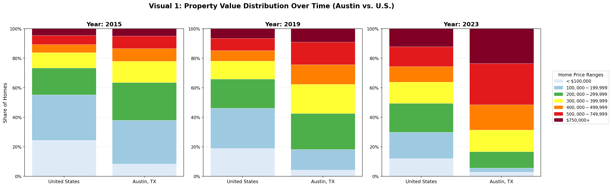

# Visualization Guide: Property Value Distribution Over Time

## Visual 1: Property Value Distribution Over Time (Austin vs. U.S.)

### Overview
This interactive visualization demonstrates how Austin's housing market has shifted dramatically toward higher-priced homes over the past decade (2015-2023) compared to national trends.

### Purpose
By highlighting Austin's disproportionate share of expensive homes, this visualization directly supports arguments about affordability challenges in the Austin housing market.

### Static Preview

*The image above shows snapshots from 2015, 2019, and 2023. The full interactive version with a year slider is available in the `analysis.ipynb` notebook.*

### Key Findings

#### 2015 Baseline
- **Austin**: 38.0% of homes were affordable (<$200K)
- **Austin**: 13.4% of homes were expensive ($500K+)

#### 2023 Current State
- **Austin**: Only 5.7% of homes are affordable (<$200K)
- **Austin**: 51.4% of homes are expensive ($500K+)

#### Dramatic Shift
- **Decrease in Affordable Homes**: -32.3 percentage points
- **Increase in Expensive Homes**: +38.0 percentage points

This represents a complete transformation of the Austin housing market, with affordable homes nearly disappearing while expensive properties now dominate.

### Design Elements

#### Color Scheme
The visualization uses a sequential color palette that creates a clear visual gradient:
- **Light Blue** (#deebf7) - < $100,000 (most affordable)
- **Medium Blue** (#9ecae1) - $100,000 - $199,999
- **Green** (#4daf4a) - $200,000 - $299,999
- **Yellow** (#ffff33) - $300,000 - $399,999
- **Orange** (#ff7f00) - $400,000 - $499,999
- **Red** (#e31a1c) - $500,000 - $749,999
- **Deep Red** (#800026) - $750,000+ (most expensive)

#### Interactivity Features
1. **Year Slider**: Move through years 2015-2023 to see how distributions evolve
2. **Hover Tooltips**: Display detailed information including:
   - Region name
   - Year
   - Price range
   - Share percentage
   - Number of homes

#### Chart Type
- **Stacked Bar Chart** with normalized percentages
- Allows easy comparison between Austin and U.S. trends
- Each bar represents 100% of housing stock
- Segments show proportion in each price range

### How to Use the Interactive Version

1. Open `analysis.ipynb` in Jupyter Notebook or JupyterLab
2. Run the visualization cell
3. Use the year slider to explore different years
4. Hover over segments to see detailed statistics
5. Compare the relative heights of color segments between Austin and U.S.

### Data Source
- Original data: `data files/austin_property_value.csv`
- Contains property value distributions for Austin, TX and United States
- Years covered: 2015-2023
- Original 26 price buckets consolidated into 7 intuitive ranges

### Technical Implementation
- **Library**: Altair (declarative statistical visualization)
- **Data Processing**: Pandas
- **Price Consolidation**: 26 original Census buckets → 7 major ranges
- **Normalization**: Percentages shown as share of total housing stock

### Insights for Analysis
This visualization is particularly effective for:
1. **Demonstrating Market Shift**: Clear visual evidence of Austin's move upmarket
2. **Comparing to National Trends**: Side-by-side comparison with U.S. average
3. **Supporting Affordability Arguments**: Quantifies the loss of affordable housing
4. **Temporal Analysis**: Year slider shows the speed of change
5. **Stakeholder Communication**: Intuitive colors and labels make insights accessible

### Next Steps
Consider creating additional visualizations to complement this analysis:
- Income growth vs. housing price growth
- Rent burden by income quintile
- Geographic distribution within Austin
- Comparison with other major cities
